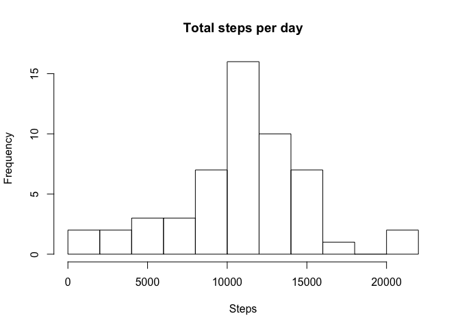

## Loading and preprocessing the data
The source data for this assessment is in the *activity.zip* file.  

This data is from a personal activity monitoring device that collects data at 5 
minute intervals throughout the day. The data consists of two months of data from
an anonymous individual collected during the months of October and November, 2012
and include the number of steps taken in 5 minute intervals each day.  

The variables included in this dataset are:  
1. *steps:* Number of steps taking in a 5-minute interval (missing values are 
coded as NA).  
2. *date:* The date on which the measurement was taken in YYYY-MM-DD format.  
3. *interval:* Identifier for the 5-minute interval in which measurement was taken.  

The dataset is stored in a comma-separated-value (CSV) file and there are a total
of 17,568 observations in this dataset.  

First, load the data and take a cursory look.

```r
data <- read.csv(unzip('activity.zip'))
str(data)
```

```
## 'data.frame':	17568 obs. of  3 variables:
##  $ steps   : int  NA NA NA NA NA NA NA NA NA NA ...
##  $ date    : Factor w/ 61 levels "2012-10-01","2012-10-02",..: 1 1 1 1 1 1 1 1 1 1 ...
##  $ interval: int  0 5 10 15 20 25 30 35 40 45 ...
```

Convert date column to Date object. 

```r
data$date <- as.Date(data$date, "%Y-%m-%d")
```
 
Remove NA values for subsequent analyses

```r
data2 <- data[!is.na(data$steps), ]
```

## What is the mean total number of steps taken per day?
Calculate total number of steps taken per day, make a histogram of the total number of steps taken each day. 

```r
library(dplyr)
stepsPerDay <- data2 %>% group_by(date) %>% summarise(totalSteps = sum(steps))
hist(stepsPerDay$totalSteps, 
     main = "Total steps per day",
     xlab = "Steps",
     ylab = "Frequency",
     breaks= 10)
```

<!-- -->

Calculate and report the mean and median of the total number of steps taken per day  

```r
meanStepsPerDay <- mean(stepsPerDay$totalSteps)
medianStepsPerDay <- median(stepsPerDay$totalSteps)
```
The mean number of steps per day is **10766.19**  
The median number of steps per day is **10765**

## What is the average daily activity pattern?
Make a time series plot of the 5-minute interval (x-axis) and average number of
steps taken, averaged across all days (y-axis). 

```r
stepPattern <- data2%>% group_by(interval) %>% summarise(averageSteps = mean(steps))
plot(x= stepPattern$interval, 
     y = stepPattern$averageSteps,
     type = "l",
     main = "Average daily activity pattern",
     xlab = "5-minute interval",
     ylab = "Average number of steps")
```

<!-- -->

Which 5-minute interval, on average across all the days in the dataset, contains 
the maximum number of steps?

```r
maxInterval = stepPattern$interval[which.max(stepPattern$averageSteps)]
```
The 5-minute interval with maximum number of steps on average across all days
is **835**

## Imputing missing values
There are a number of days/intervals where there are missing values. The presence 
of missing days may introduce bias into some calculations or summaries of the data.  

Calculate and report the total number of missing values in the dataset.

```r
missingData <- apply(data, 2, function(x) sum(is.na(x)))
missingData
```

```
##    steps     date interval 
##     2304        0        0
```
There are **2304** missing values in the dataset.

Create a new dataset with missing values imputed by using mean steps for the day.
If there are no values recorded for that day, assume values are 0. 

```r
data3 <- data %>% group_by(date) %>%
        mutate(imputedSteps = ifelse(is.na(steps), mean(steps, na.rm=TRUE), steps)) %>%
        mutate(imputedSteps = ifelse(is.nan(imputedSteps), 0, steps))
```


Make a histogram of the total number of steps taken each day. Calculate and report 
the mean and median total number of steps taken per day.

```r
imputedStepsPerDay <- data3 %>% group_by(date) %>% 
        summarise(totalSteps = sum(imputedSteps))
hist(imputedStepsPerDay$totalSteps, 
     main = "Total steps per day (NAs imputed)",
     xlab = "Steps",
     ylab = "Frequency",
     breaks= 10)
```

<!-- -->

```r
imputedMeanStepsPerDay <- mean(imputedStepsPerDay$totalSteps)
imputedMedianStepsPerDay <- median(imputedStepsPerDay$totalSteps)
```
The mean number of steps per day (with NAs imputed) is **9354.23**. 
The mean number of steps (with NAs omitted) is **10766.19**.  
The median number of steps per day (with NAs imputed)is **10395**. 
The median number of steps per day (with NAs imputed) is **10765**.  

These values **do not differ significantly** from estimates from the first part of 
the assignment. The impact of imputing missing data on the estimates of the total
daily number of steps is **small**.

## Are there differences in activity patterns between weekdays and weekends?
Create a new factor variable in the dataset with two levels – “weekday” and 
“weekend” indicating whether a given date is a weekday or weekend day.

```r
data4 <- data3 %>% mutate(weekday = weekdays(date), 
                          dayType = ifelse(test = weekday %in% c("Saturday", "Sunday"), 
                                           yes = "weekend", 
                                           no = "weekday")) %>%
        mutate(dayType = factor(dayType, levels = c("weekend", "weekday")))
```

Make a panel plot containing a time series plot of the 5-minute interval (x-axis) 
and the average number of steps taken, averaged across all weekday days or weekend 
days (y-axis).


```r
stepsByDayType <- data4 %>% group_by(dayType, interval) %>% 
        summarize(meanSteps=mean(imputedSteps))
weekdaySteps <- filter(stepsByDayType, dayType == "weekday")
weekendSteps <- filter(stepsByDayType, dayType == "weekend")

par(mfrow=c(2,1))

with(weekdaySteps, 
     plot(interval, meanSteps, type = "l",
          main = "Average steps on weekdays",
          xlab = "5-minute interval",
          ylab = "Average number of steps"))

with(weekendSteps, 
     plot(interval, meanSteps, type = "l",
          main = "Average steps on weekends",
          xlab = "5-minute interval",
          ylab = "Average number of steps"))
```

<!-- -->

